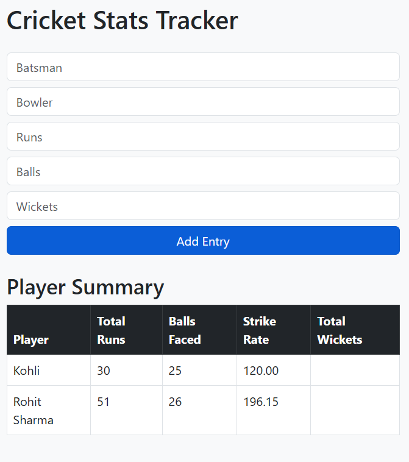
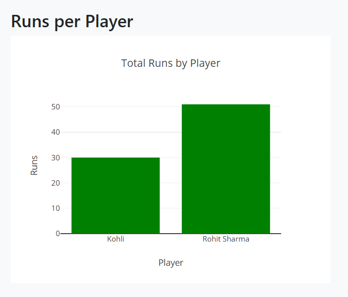
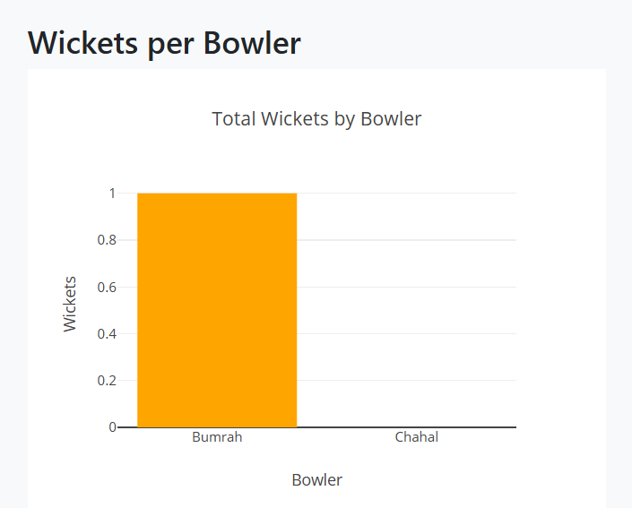

# 🏏 Cricket Stats Tracker

A web application to track cricket match statistics including runs, balls, strike rate, and wickets — built using **Python (Flask)**, **SQLite**, **Bootstrap**, and **Plotly**.




---

## 🚀 Features

- 🎯 Add batsman and bowler performance in real time
- 📊 Dynamic charts for:
  - Total Runs by Player (bar graph)
  - Total Wickets by Bowler (bar graph)
- 📋 Auto-calculated strike rate
- 💅 Clean and responsive Bootstrap UI
- 💾 Data stored in SQLite

---

## 📂 Tech Stack

| Frontend     | Backend     | Database | Visualization |
|--------------|-------------|----------|----------------|
| HTML, CSS, Bootstrap | Python (Flask) | SQLite   | Plotly.js       |

---

## 🖥️ Screenshots

### ➤ Form & Table


### ➤ Runs per Player


### ➤ Wickets per Bowler


---

## 🛠️ Local Setup

```bash
# 1. Clone the repo
git clone https://github.com/Sriram-Mullapudi/cricket-stats-tracker.git
cd cricket-stats-tracker

# 2. Create virtual environment
python -m venv venv
venv\Scripts\activate  # Windows

# 3. Install dependencies
pip install -r requirements.txt

# 4. Run the app
python app.py
